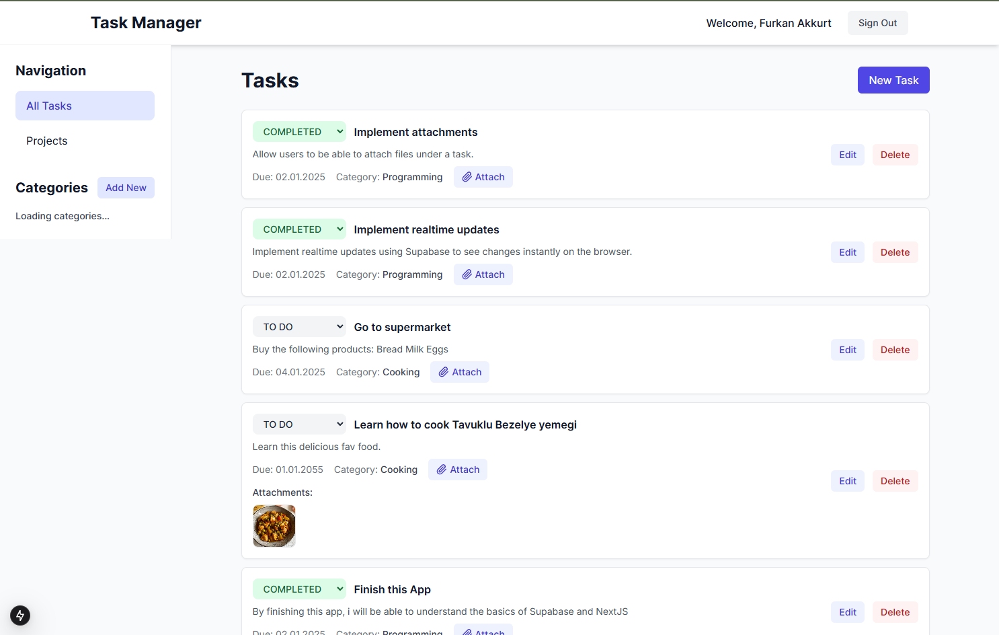

# Task Manager with Supabase and Next.js

[](https://nextjs.org/)
[](https://supabase.com/)
[](https://www.typescriptlang.org/)
[](https://tailwindcss.com/)
[](https://opensource.org/licenses/MIT)

A modern task management application built with Next.js, Supabase, and Tailwind CSS. Manage your tasks and projects with real-time updates, categorization, and team collaboration.



## ✨ Features

- **Authentication**
  - Email/Password sign up and sign in
  - Protected routes and API endpoints
  - Profile management

- **Task Management**
  - Create, edit, and delete tasks
  - Set task priority and due dates
  - Organize tasks with categories
  - Real-time updates
  - Task status tracking

- **Project Management**
  - Create and manage projects
  - Organize tasks within projects
  - Project status tracking
  - Team collaboration
  - Real-time project updates

- **Categories**
  - Create custom categories
  - Filter tasks by category
  - Color-coded organization

## 🚀 Tech Stack

- **Frontend**: Next.js 13 (App Router), React, TypeScript
- **Styling**: Tailwind CSS
- **Backend**: Supabase (PostgreSQL, Authentication, Real-time)
- **State Management**: React Context
- **Forms**: React Hook Form
- **Deployment**: Vercel

## 🛠️ Getting Started

1. Clone the repository:
   ```bash
   git clone https://github.com/yourusername/task-manager-supabase-next.git
   cd task-manager-supabase-next
   ```

2. Install dependencies:
   ```bash
   npm install
   ```

3. Create a Supabase project and get your credentials:
   - Go to [Supabase](https://supabase.com)
   - Create a new project
   - Get your project URL and anon key

4. Set up environment variables:
   ```bash
   cp .env.example .env.local
   ```
   Fill in your Supabase credentials in `.env.local`

5. Run database migrations:
   ```bash
   npx supabase db push
   ```

6. Start the development server:
   ```bash
   npm run dev
   ```

7. Open [http://localhost:3000](http://localhost:3000) in your browser

## 📁 Project Structure

```
├── src/
│   ├── app/                 # Next.js app router pages
│   ├── components/          # React components
│   │   ├── auth/           # Authentication components
│   │   ├── layout/         # Layout components
│   │   ├── projects/       # Project management components
│   │   └── tasks/          # Task management components
│   ├── contexts/           # React contexts
│   ├── hooks/              # Custom hooks
│   ├── lib/                # Utility functions and services
│   │   └── services/       # API service classes
│   └── types/              # TypeScript type definitions
├── public/                 # Static files
└── supabase/              # Supabase configurations and migrations
    └── migrations/        # Database migrations
```

## 🔥 Features in Detail

### Authentication
- Secure email/password authentication
- Protected routes using middleware
- User profile management
- Session persistence

### Task Management
- Create, edit, and delete tasks
- Set priority levels (Low, Medium, High)
- Add due dates
- Track task status (Todo, In Progress, Done)
- Organize tasks with categories
- Real-time updates when tasks change

### Project Management
- Create and manage projects
- Group related tasks together
- Track project status (Active, Completed, On Hold, Cancelled)
- View project progress
- Real-time project updates

### Categories
- Create custom categories for tasks
- Assign colors to categories
- Filter tasks by category
- Edit and delete categories

## 🤝 Contributing

1. Fork the repository
2. Create your feature branch (`git checkout -b feature/amazing-feature`)
3. Commit your changes (`git commit -m 'Add some amazing feature'`)
4. Push to the branch (`git push origin feature/amazing-feature`)
5. Open a Pull Request

## 📝 License

This project is licensed under the MIT License - see the [LICENSE](LICENSE) file for details.

## 🙏 Acknowledgments

- [Next.js](https://nextjs.org/) - The React Framework for Production
- [Supabase](https://supabase.com/) - The Open Source Firebase Alternative
- [Tailwind CSS](https://tailwindcss.com/) - A utility-first CSS framework
- [React Hook Form](https://react-hook-form.com/) - Performant, flexible and extensible forms
